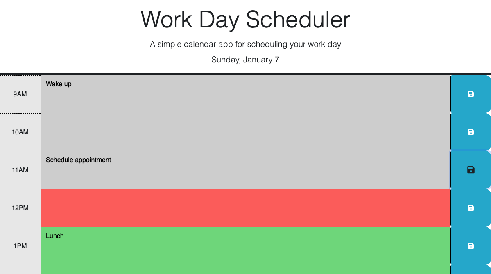

# Work Day Scheduler

## Description

The purpose of this project was to create a simple calendar application that allows a user to save events for each hour of a typical working day. This app will run in the browser and feature dynamically updated HTML and CSS powered by jQuery and Day.js. 

Each hour time block is color-coded to indicate whether it is in the past, present, or future. Any text saved in a given time block is saved to local storage so that events persist upon refreshing the page.

## Installation

The project can be found at the following GitHub Page: https://j-preim.github.io/work-day-scheduler/

## Usage

The website will appear as it does in the following screenshot:

## Credits

Starter code was used from the provided repository.

## License

Copyright (c) 2023 Joe Preimesberger

Licensed under the MIT license.